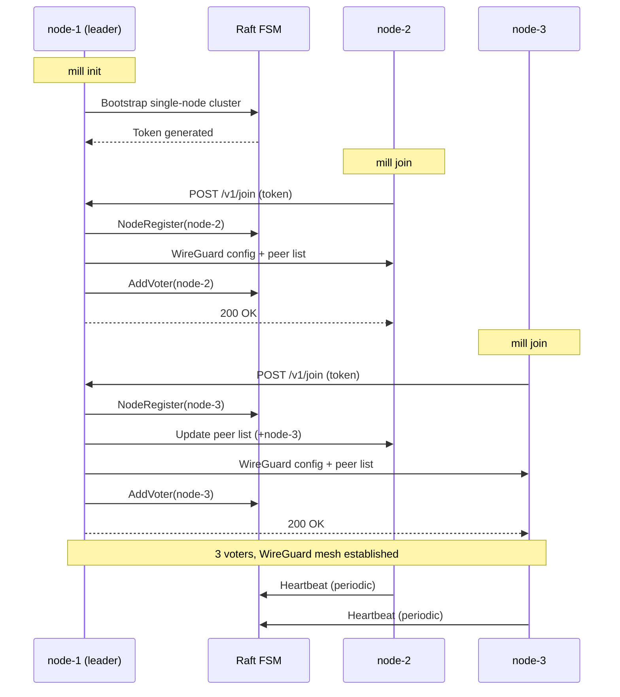

# Workflow: Cluster Formation

Standing up a 3-node Mill cluster from scratch.

## Diagram



## Steps

### 1. Bootstrap the first node

```bash
node-1$ mill init --advertise 10.0.0.1 --provider digitalocean --provider-token <do-token>
# => Token: mill_t_7f3a...
```

Raft starts with node-1 as the sole voter. A WireGuard keypair is generated.

### 2. Join nodes 2 and 3

```bash
node-2$ mill join 10.0.0.1:4400 --advertise 10.0.0.2 --token mill_t_7f3a...
node-3$ mill join 10.0.0.1:4400 --advertise 10.0.0.3 --token mill_t_7f3a...
```

Each join: authenticate with token, commit `NodeRegister` to FSM, add WireGuard
peer, add Raft voter, broadcast updated peer list.

## Verify

```bash
$ mill status
CLUSTER: 3 nodes, all healthy
NODES
  NAME    STATUS  CPU    MEM     ALLOCS
  node-1  ready   0/4    0/8G    0
  node-2  ready   0/4    0/8G    0
  node-3  ready   0/2    0/4G    0
```

## Key Points

- **Token auth:** The join token authenticates join requests and serves as the API bearer token for all client operations.
- **Raft voters:** Each node is added as a voter. With 3 voters the cluster tolerates 1 failure (quorum = 2).
- **WireGuard mesh:** Every join broadcasts an updated peer list. All node-to-node traffic is encrypted from that point forward.
- **Heartbeats:** Secondaries send periodic heartbeats. A 15s missed window triggers `NodeDown` and workload rescheduling.
