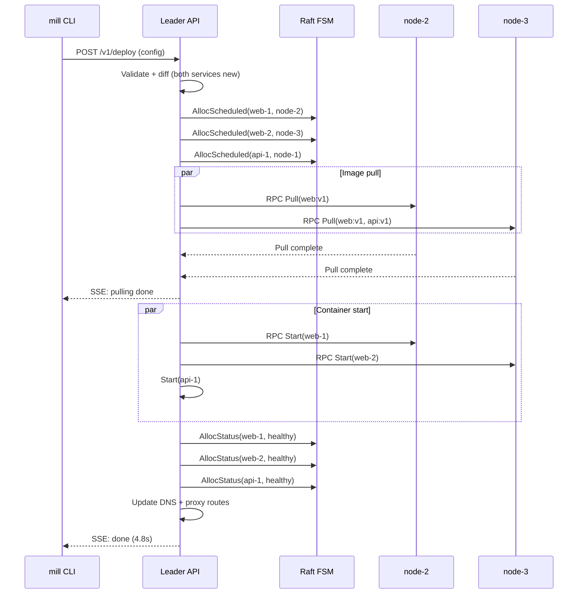

# Workflow: First Deploy

Deploying two services to a fresh 3-node cluster.

## Diagram



## Steps

### 1. Write a config

```hcl
service "web" {
  image = "registry.example.com/web:v1"
  port = 3000; replicas = 2; cpu = 0.5; memory = "512M"
  health { path = "/health"; interval = "5s" }
  route "app.example.com" { path = "/" }
}

service "api" {
  image = "registry.example.com/api:v1"
  port = 8080; cpu = 1; memory = "1G"
  env { DATABASE_URL = "${secret(db.url)}" }
  health { path = "/healthz"; interval = "10s" }
}
```

### 2. Deploy

Config sent to `POST /v1/deploy`. Leader validates, diffs against FSM state
(empty — both services are new), then runs the pipeline:

1. **Schedule** — replicas placed by resources and spread. `AllocScheduled` per replica.
2. **Pull** — images pulled in parallel on target nodes. Cached = skipped.
3. **Start** — secondaries start containers via containerd.
4. **Health check** — leader polls each alloc. On pass, commits `AllocStatus(healthy)`.
5. **Route** — DNS and proxy routes updated. External traffic flows.

```
$ mill deploy -f app.mill
  pulling images...
  web: scheduled on node-2
  web: scheduled on node-3
  api: scheduled on node-1
  web: healthy (2.0s)
  api: healthy (1.2s)
  deployed (4.8s)
```

## Key Points

- **Parallel pulls:** Images pulled simultaneously across target nodes.
- **Spread scheduling:** Avoids co-locating replicas of the same service.
- **Volume affinity:** Volume-backed services placed where the volume is attached.
- **Atomic rollback:** If any service fails health checks, new allocs are killed.
- **SSE stream:** CLI receives real-time phase transitions via server-sent events.
