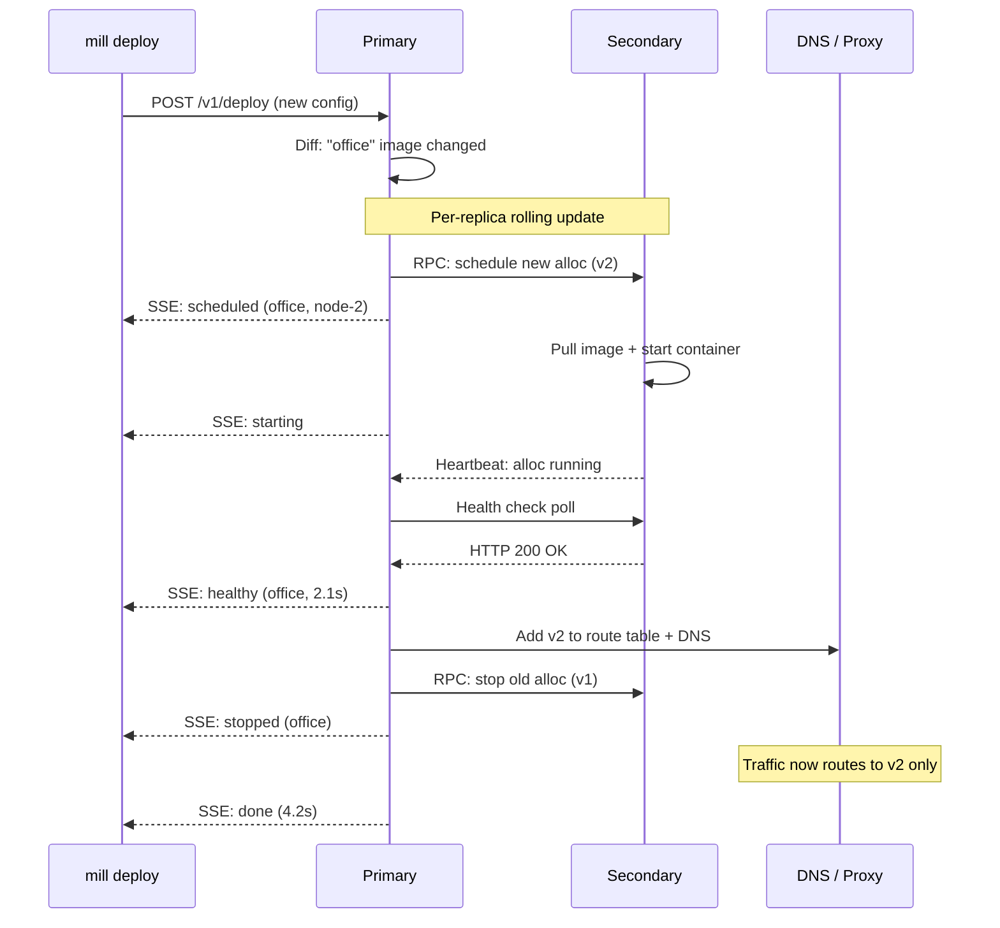

# Workflow: Rolling Update

Zero-downtime deploy when a service's image changes.

## Diagram



## Steps

### 1. Trigger

```bash
mill deploy -f production.mill   # image tag changed for "office"
```

The primary diffs the new config against FSM state. Only the changed service
enters the rolling update path. Unchanged services are skipped.

### 2. Per-replica cycle

For each replica, sequentially:

1. **Schedule new alloc** — primary commits `AllocScheduled` to Raft.
2. **Pull image** — secondary pulls the new image (or uses cache).
3. **Start container** — containerd create + start. Status moves to `running`.
4. **Health check** — primary polls the health endpoint until `healthy`.
5. **Route traffic** — DNS records and proxy route table updated to include new alloc.
6. **Stop old alloc** — old container stopped. Status moves to `stopped`.

The next replica does not begin until the current one is healthy and receiving
traffic. This guarantees `healthy >= 1` throughout.

### 3. Completion

```
$ mill deploy -f production.mill
  office: scheduled on node-2
  office: healthy (2.1s)
  office: old instance stopped
  deployed (4.2s)
```

## Key Points

- **Zero-downtime:** At least one healthy replica exists at every point.
- **Atomic route update:** DNS and proxy updated before the old alloc stops.
- **Sequential cycling:** N replicas = N sequential cycles.
- **Rollback on failure:** A single replica health check failure aborts the
  update (see [04-deploy-rollback](./04-deploy-rollback.md)).
