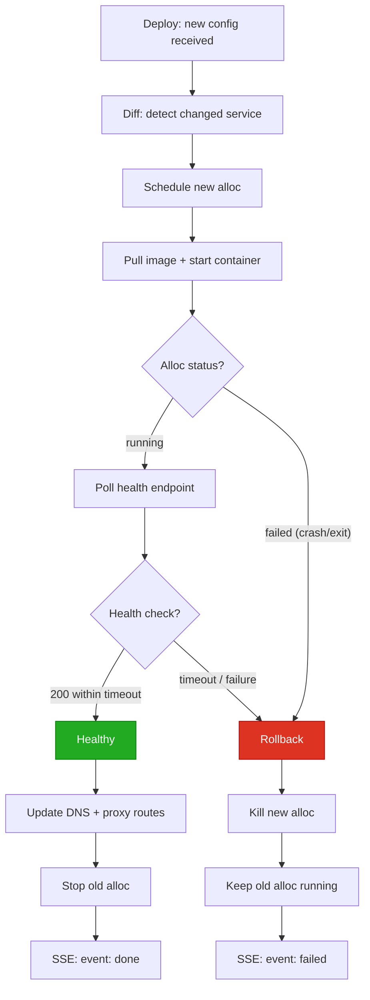

# Workflow: Deploy Rollback

Automatic rollback when a new version fails health checks.

## Diagram



## Steps

### 1. Trigger

```bash
mill deploy -f production.mill   # "office" image updated to a bad version
```

Failure causes: crash loop, misconfigured health endpoint, image that exits
immediately, health check timeout.

### 2. New alloc starts but never becomes healthy

Primary diffs config, begins rolling update. New alloc reaches `running` on the
secondary, but the health endpoint never returns 200. After the health check
timeout (default 30s), the primary declares failure.

### 3. Rollback

Primary kills the new alloc and aborts the deploy. The old alloc was never
stopped and continues serving traffic. DNS and proxy routes were never modified.

### 4. SSE stream

The stream never emits `healthy` or `stopped`. The terminal event is `failed`:

```
event: progress
data: {"phase": "started"}

event: progress
data: {"service": "office", "phase": "scheduled", "node": "node-2"}

event: progress
data: {"service": "office", "phase": "starting"}

event: failed
data: {"service": "office", "reason": "health check timeout after 30s"}
```

```
$ mill deploy -f production.mill
  office: scheduled on node-2
  office: starting...
  office: failed: health check timeout after 30s
  deploy failed
```

## Key Points

- **No downtime:** The old alloc is never stopped during a failed deploy.
- **No route change:** DNS and proxy routes are never updated until healthy.
- **Cleanup:** The new alloc is always killed on failure.
- **Per-service:** If service A succeeds but B fails, A keeps its new version
  and B keeps its old version.
