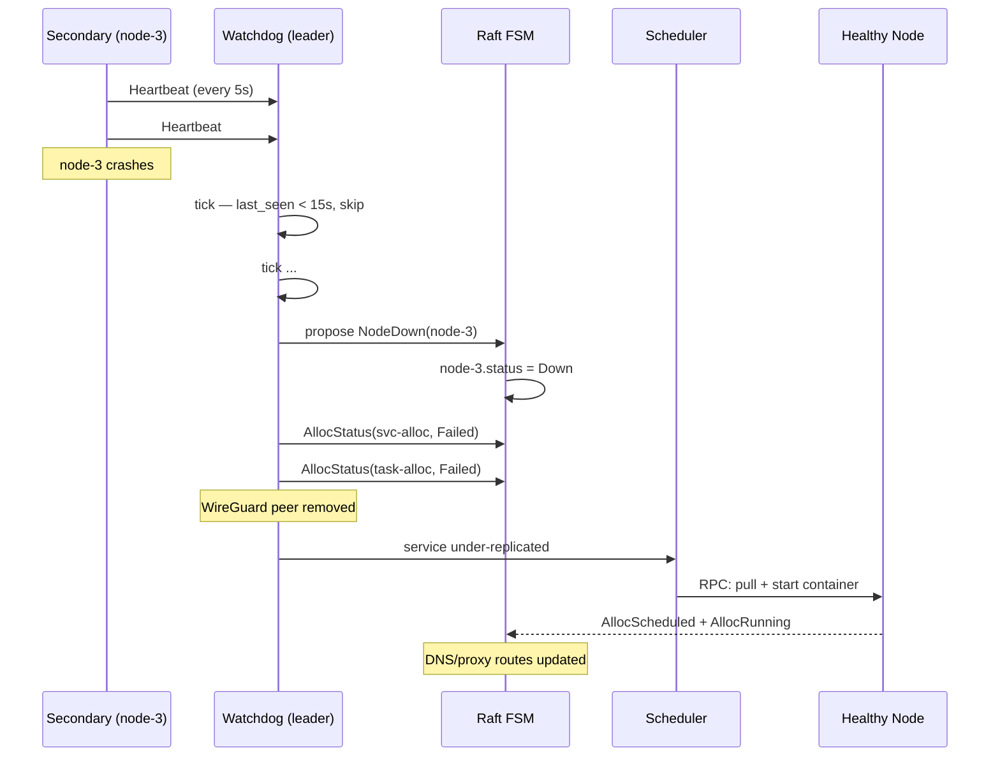

# Workflow: Node Failure & Reschedule

A secondary stops heartbeating; the leader marks it down and reschedules services.

## Diagram



## Steps

### 1. Heartbeat timeout

Secondaries send `NodeHeartbeat` every 5s. The watchdog ticks every 1s and
compares `now()` against each node's last-seen timestamp. When the gap exceeds
15s, the watchdog proposes `NodeDown(id)`.

### 2. FSM transition

`NodeDown` sets `node.status = Down`. The node remains in the cluster — it may
recover. A future heartbeat flips it back to `Ready`.

### 3. Allocs marked failed

The watchdog marks all non-terminal allocs on the downed node as `Failed`.
Service allocs have their backoff state reset so the restart phase picks them up
immediately. Task allocs stay failed — no retry.

### 4. WireGuard peer removed

The downed node's WireGuard peer is removed so traffic is no longer routed to
an unreachable endpoint.

### 5. Service reschedule

On the next watchdog tick, the restart phase detects under-replicated services
and spawns new allocs on healthy nodes. Backoff: 1s, 5s, 30s, 60s cap.

### 6. DNS and proxy update

When the new alloc reaches `Healthy`, DNS records and proxy routes are updated
to point at the new node.

## Verify

```bash
mill nodes           # node-3 status=down, 0 allocs
mill status          # service replicas back to desired count
```

## Key Points

- **Detection window:** 15s from last heartbeat to `NodeDown`.
- **Services reschedule:** Automatically placed on healthy nodes with backoff.
- **Tasks fail:** Ephemeral tasks are marked failed, never retried by Mill.
- **Recovery:** A resumed heartbeat flips the node back to `Ready` and re-adds
  its WireGuard peer. The node is healthy but empty — the scheduler can place
  new work on it.

| Parameter | Default | Env override |
|-----------|---------|--------------|
| Heartbeat interval | 5s | `MILL_HEARTBEAT_INTERVAL_MS` |
| Heartbeat timeout | 15s | `MILL_HEARTBEAT_TIMEOUT_MS` |
| Watchdog tick | 1s | `MILL_WATCHDOG_TICK_MS` |
| Restart backoff | 1s, 5s, 30s, 60s | — |
