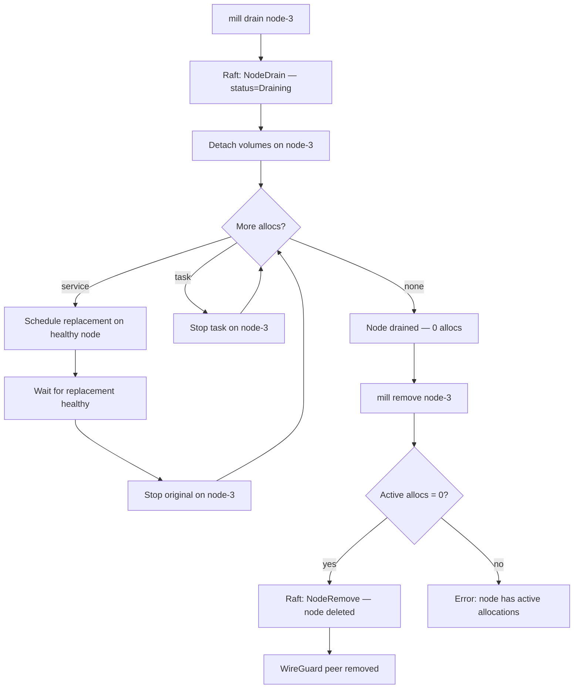

# Workflow: Drain & Remove Node

Operator decommissions a node by migrating its allocs, then removing it.

## Diagram



## Steps

### 1. Drain

```bash
mill drain node-3
```

1. **Mark unschedulable** — `NodeDrain(id)` committed to Raft. The scheduler
   will not place new work on a draining node.
2. **Detach volumes** — persistent volumes detached via cloud driver, marked
   `Ready` in FSM for re-attachment on the replacement node.
3. **Migrate services** — for each service alloc: schedule replacement on a
   healthy node, wait for it to reach `Healthy`, then stop the original.
   One at a time — zero downtime.
4. **Stop tasks** — task allocs stopped directly. Tasks are ephemeral and do
   not migrate.

### 2. Remove

```bash
mill remove node-3
```

1. **Pre-check** — FSM rejects `NodeRemove` if the node has non-terminal allocs.
2. **Delete** — node removed from `fsm.nodes`, stopped/failed allocs cleaned up.
3. **Cleanup** — WireGuard peer deleted from the mesh.

## Verify

```bash
mill nodes           # node-3 status=draining, 0 allocs
mill remove node-3
mill nodes           # node-3 no longer listed
mill status          # N-1 nodes, all services healthy
```

## Key Points

- **Zero-downtime migration:** Each service replacement is healthy before the
  original is stopped.
- **Tasks are not migrated:** Stopped directly; caller decides whether to retry.
- **Remove is guarded:** Fails if the node still has active allocations.
- **Volume handoff:** Persistent volumes are detached before migration so the
  replacement node can attach them.

| Error case | Behavior |
|------------|----------|
| `remove` on non-drained node | Rejected: "node still has active allocations" |
| Replacement fails during drain | Original kept running; drain reports failure |
| Node already down when drained | Allocs already failed; drain detaches volumes and completes |
