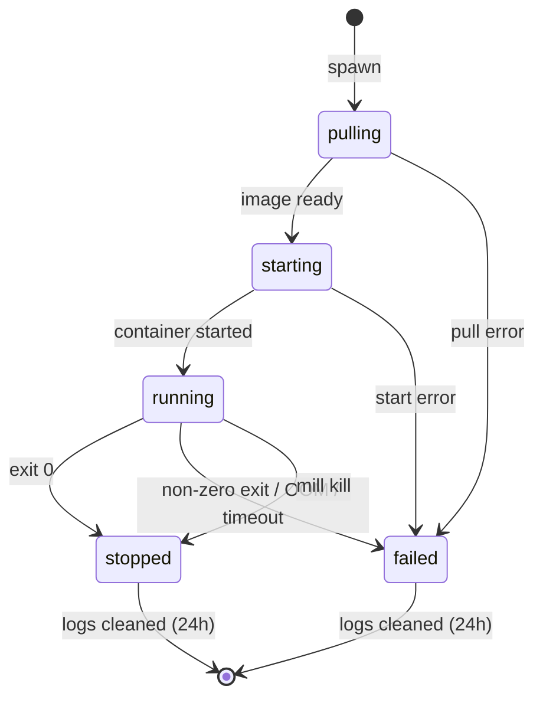

# Workflow: Task Lifecycle

Spawn an ephemeral task, observe it run, and retrieve its logs.

## Diagram



## Steps

### 1. Spawn

From a config template or inline:

```bash
mill spawn coop-agent --env SESSION_ID=abc123
mill spawn --image registry.example.com/myapp:v3 --cpu 1 --memory 2G --timeout 30m
```

Both hit `POST /v1/tasks/spawn` and return immediately:

```
id:      coop-agent-x7k2
address: coop-agent-x7k2.mill:8080
status:  starting
```

The task gets a `*.mill` DNS address usable by other containers.

### 2. Monitor

```bash
mill ps
```

```
NAME              NODE    STATUS   CPU   MEM     ELAPSED
coop-agent-x7k2   node-3  running  0.8   1.2G    12m
```

### 3. Stream logs

Logs are available while the task runs and for 24 hours after it stops.

```bash
mill logs coop-agent-x7k2 -f       # follow live output
mill logs coop-agent-x7k2 -n 50    # last 50 lines
```

### 4. Completion or failure

Exit 0 → `stopped`. Non-zero exit, OOM, or timeout → `failed`. The task is
**not** restarted. The caller inspects status via `GET /v1/tasks/:id` and
decides whether to retry.

### 5. Kill early

```bash
mill kill coop-agent-x7k2    # DELETE /v1/tasks/coop-agent-x7k2
```

### 6. Log cleanup

Logs retained 24 hours after terminal state (configurable via
`MILL_LOG_RETENTION_SECS`), or until the per-node log store exceeds its
size limit (`MILL_LOG_MAX_BYTES`, default 512 MiB) — whichever comes first.

## Key Points

- **No restart:** Tasks are never restarted by Mill.
- **Timeout:** Configurable per-task (default 1h). Killed on expiry.
- **DNS:** `<task-id>.mill:<port>` available immediately after spawn.
- **Resources:** Single value — both reservation and cgroup limit.
- **Node failure:** Task marked `failed`, not rescheduled.
- **Log retention:** 24 hours after terminal state, or max store size (configurable via env).
