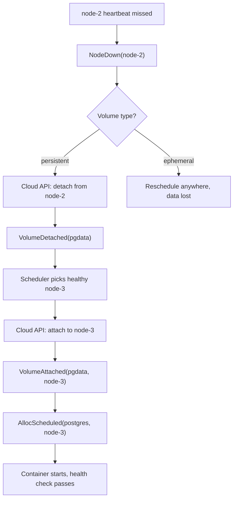

# Workflow: Volume Affinity & Migration

Persistent volumes pin services to nodes; on failure, the volume migrates first.

## Diagram



## Steps

### 1. Config

```hcl
service "postgres" {
  image  = "postgres:16"
  port   = 5432
  cpu    = 1
  memory = "2G"

  volume "pgdata" {
    path = "/var/lib/postgresql/data"
    size = "50Gi"
  }
}
```

### 2. First deploy

```
$ mill deploy -f production.mill
  postgres: creating volume pgdata (50Gi)... done
  postgres: attaching pgdata to node-2... done
  postgres: healthy (3.1s)
  deployed (5.8s)
```

FSM commands: `VolumeCreated(pgdata, vol-abc123, node-2)` →
`VolumeAttached(pgdata, node-2)` → `AllocScheduled(postgres, node-2)`.

### 3. Subsequent deploys

The scheduler reads FSM and sees `pgdata` attached to node-2. It places the
new alloc on node-2 unconditionally. Volume-bound services never move unless
the volume moves.

### 4. Node failure triggers migration

node-2 goes down (missed heartbeats, 15s). The primary:

1. Detaches the volume from node-2 via cloud API → `VolumeDetached`.
2. Picks a healthy node (node-3), attaches via cloud API → `VolumeAttached`.
3. Schedules the service on node-3 → `AllocScheduled`.
4. Container starts with the same data on the migrated volume.

Ephemeral volumes (`ephemeral = true`) are scratch space on the host — lost
entirely on reschedule.

### 5. Volume deletion

```bash
mill volume delete pgdata   # fails if a service references it
```

Remove the volume block from config, redeploy, then delete. Commits
`VolumeDetached` → `VolumeDestroyed` and calls cloud API to destroy the device.

## Verify

```bash
$ mill volume list
NAME     STATE     NODE    CLOUD ID
pgdata   attached  node-3  vol-abc123
```

## Key Points

- **Implicit affinity:** Scheduler pins services to the volume's node automatically.
- **Automatic migration:** Node failure triggers detach → reattach via cloud API.
- **Ephemeral volumes don't migrate:** Rescheduled with fresh scratch space.
- **Deletion is guarded:** `mill volume delete` refuses if a service uses it.
