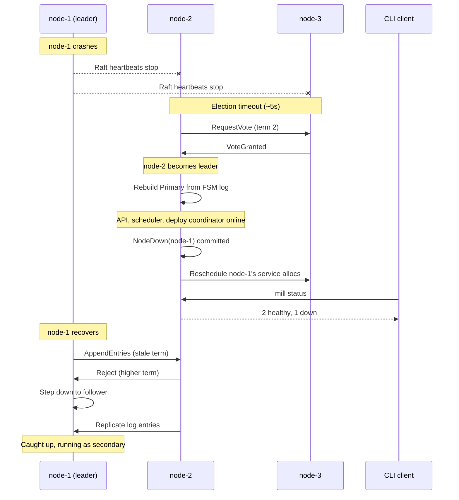

# Workflow: Leader Failover

The Raft leader crashes; surviving nodes elect a new leader and resume the API.

## Diagram



## Steps

### 1. Election

node-1 crashes. After ~5s, node-2 sends `RequestVote` for term 2. node-3
grants its vote. node-2 wins with majority (2/3) and becomes leader.

### 2. Primary rebuilt

node-2 replays the FSM log and starts the primary on port 4400: API server,
scheduler, deploy coordinator.

### 3. Dead node handled

`NodeDown(node-1)` committed. Services on node-1 rescheduled to healthy nodes.
Tasks on node-1 marked failed.

### 4. API resumes

Clients retry against node-2 or node-3 (any node forwards to the leader).
In-flight requests at crash time may fail.

### 5. Containers unaffected

Secondaries keep running their containers — no restart, no disruption. Only
node-1's containers are lost.

### 6. Old leader recovers

node-1 discovers the higher term, steps down to follower, catches up via log
replication, resumes as a secondary.

## Verify

```bash
$ mill status --address node-2:4400
CLUSTER: 2 nodes healthy, 1 down (leader: node-2)

NODES
  NAME    STATUS  CPU     MEM      ALLOCS
  node-1  down    --      --       0
  node-2  ready   1.8/4   3.2G/8G  5
  node-3  ready   1.4/2   2.8G/4G  3
```

## Key Points

- **Fast election:** New leader elected within ~5s of failure detection.
- **No data loss:** All state is in the Raft log, replicated to a majority
  before acknowledgment.
- **Workloads survive:** Containers on healthy secondaries are never restarted.
- **Clients must retry:** In-flight API requests may fail; non-leaders forward
  to the new leader.
- **Automatic rejoin:** A recovered node catches up via log replication with
  no manual intervention.
- **Network partition:** Minority side can't commit writes but containers keep
  running. Majority side has full functionality. Converges on heal.
