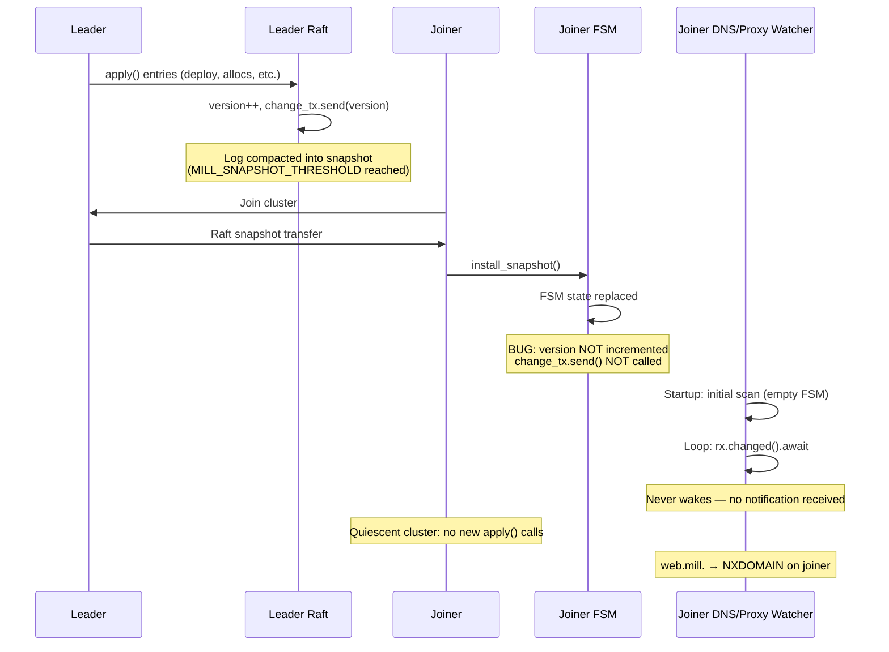

# Workflow: Snapshot Stale Watchers

A node that receives state via snapshot install has stale DNS and proxy watchers because `install_snapshot()` does not notify the change channel.

## Diagram



## Steps

### 1. Leader compacts log into snapshot

After enough log entries are committed (controlled by `MILL_SNAPSHOT_THRESHOLD`),
openraft compacts the log into a snapshot. The snapshot contains the full FSM
state serialized via `snapshot::codec::encode`.

### 2. Joiner receives snapshot via openraft transfer

When a new node joins and the leader's log has been compacted past the joiner's
last applied index, openraft transfers the snapshot instead of replaying
individual log entries.

### 3. `install_snapshot()` writes FSM but skips `change_tx.send()`

The `install_snapshot()` method at `crates/raft/src/fsm/mod.rs:176-206` replaces
the FSM state completely — `inner.fsm`, `inner.last_applied`,
`inner.last_membership`, and `inner.current_snapshot` — but never increments
`inner.version` or calls `self.change_tx.send(version)`.

Compare with `apply()` at line 152-155 which correctly does both:
```rust
inner.version += 1;
let version = inner.version;
drop(inner);
let _ = self.change_tx.send(version);
```

### 4. DNS watcher remains idle (no notification received)

`spawn_dns_watcher` and `spawn_proxy_watcher` in `crates/node/src/primary/mod.rs`
each call `raft.subscribe_changes()` and loop on `rx.changed().await`. Since
`install_snapshot()` never sends on the channel, these watchers never wake up
after the snapshot is installed.

### 5. Quiescent cluster: no subsequent `apply()` call triggers recovery

If the cluster is quiescent after the snapshot install (no new deploys, no
heartbeat-induced FSM changes), no `apply()` call will ever fire to
incidentally notify the watchers. The DNS server on the joiner remains empty
indefinitely.

## Verify

On the **leader**, DNS resolves correctly (state arrived via `apply()`):
```bash
mill dns resolve web    # → 172.18.0.10 (leader's alloc address)
```

On the **joiner**, DNS does not resolve (state arrived via `install_snapshot()`):
```bash
mill dns resolve web    # → timeout / NXDOMAIN
```

## Key Points

| Aspect | Detail |
|--------|--------|
| Severity | High — DNS and proxy routes silently stale on snapshot receivers |
| Affected subsystems | DNS watcher, proxy watcher, connection watcher |
| Trigger condition | Snapshot transfer only (not log replay) |
| Clusters affected | Any node that joins after log compaction |
| Recovery workaround | Any subsequent `apply()` (e.g. a new deploy) incidentally notifies watchers |
| One-line fix | Add `inner.version += 1; self.change_tx.send(version);` to `install_snapshot()` |

| Parameter | Default | Env override |
|-----------|---------|--------------|
| Snapshot threshold | 5000 entries | `MILL_SNAPSHOT_THRESHOLD` |
| Snapshot log keep | 1000 entries | `MILL_SNAPSHOT_LOG_KEEP` |
