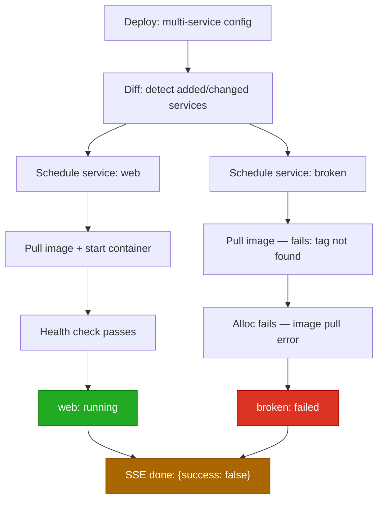

# Workflow: Partial Deploy Failure

A multi-service deploy where some services succeed and others fail.
The HTTP response is always 200; callers must inspect the SSE stream.

## Diagram



## Steps

### 1. Trigger

```bash
mill deploy -f production.mill   # config contains "web" (good) and "broken" (bad image)
```

### 2. Deploy proceeds service-by-service

Primary diffs the config against current FSM state. Each service is processed
independently. `web` schedules, pulls, starts, and passes health checks.
`broken` fails at image pull — the image tag does not exist.

### 3. Partial failure is recorded

The primary sets `has_failures = true` for the failing service and emits an
SSE `failed` event. The good service continues to run normally.

### 4. SSE stream

The HTTP response is `200 OK` regardless of partial failure. The deploy result
is signalled **only** through the terminal `done` event in the SSE body:

```
event: progress
data: {"service": "web", "phase": "scheduled", "node": "node-1"}

event: progress
data: {"service": "web", "phase": "healthy"}

event: failed
data: {"service": "broken", "reason": "image pull failed: tag not found"}

event: done
data: {"elapsed": 12.4, "success": false}
```

```
$ mill deploy -f production.mill
  web:    scheduled on node-1
  web:    healthy
  broken: failed: image pull failed: tag not found
  deploy finished with errors
```

### 5. State after partial failure

- `web` is running with its new config.
- `broken` has no running allocations. If it previously existed it retains its
  last healthy version (if a rolling update was in progress) or has no allocs.

## Key Points

- **HTTP status is always 200.** The SSE stream is the response body; the
  status code is sent before the deploy executes.
- **`"success": false` is the only failure signal.** Callers that check only
  the HTTP status code will silently miss partial failures.
- **Per-service isolation.** A failure in one service does not roll back
  successful updates in other services.
- **No compensation for removed services.** If the config removes a service
  and the removal step is skipped due to a partial failure, the removed
  service's containers may keep running (see bug: config committed before
  containers stop).
