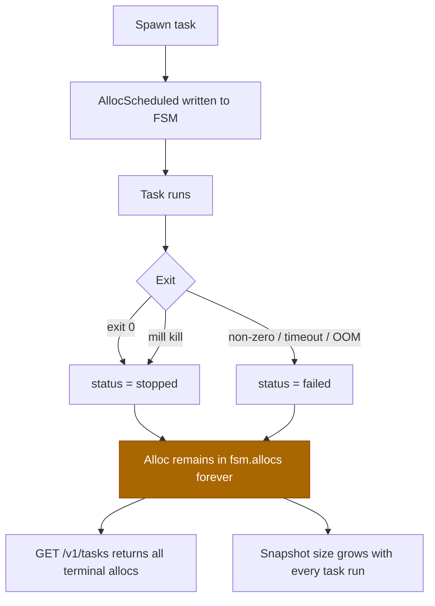

# Workflow: Alloc Leak — Terminal Allocs Never Pruned

Terminal task allocations (`stopped`, `failed`) are never removed from the
FSM alloc map. With frequent task runs the map grows without bound, increasing
snapshot size and slowing every operation that iterates `fsm.allocs`.

## Diagram



## Steps

### 1. Normal task run

```bash
mill spawn --image busybox:latest --timeout 1s
```

The task is scheduled, runs, and reaches a terminal state within seconds.

### 2. FSM state after task completes

The alloc's status transitions to `stopped` or `failed`, but the entry in
`fsm.allocs` is **never deleted**. The only cleanup path is `NodeRemove`,
which purges all allocs for a removed node. Active-node allocs are never
pruned.

### 3. Task list grows without bound

```bash
mill tasks
```

Every task that has ever run appears in the list, including all terminal
entries. There is no TTL, no GC command, and no periodic pruning.

### 4. Observable effects

| Symptom | Root cause |
|---|---|
| `GET /v1/tasks` response size grows linearly with task history | `get_tasks` iterates all allocs unfiltered |
| Raft snapshots grow over time | Snapshot serialises the full alloc map |
| `node_available_resources` slows down | Iterates all allocs, filtering terminal ones each call |
| Watchdog loop slows down | `check_service_restarts` iterates all allocs each tick |

### 5. Workaround (until GC is implemented)

Remove and re-add a node to flush its terminal allocs:

```bash
mill drain  node-1
mill remove node-1
mill join   <leader-addr> --token <token>
```

This triggers `NodeRemove` in the FSM, which calls
`allocs.retain(|_, a| a.node != mill_id)` — the only current pruning path.

## Key Points

- **No GC command exists.** There is no `AllocGC` or `AllocExpired` FSM
  command. Adding one is the correct fix.
- **Tasks are most affected.** Services have a bounded number of allocs
  (bounded by `replicas`). Tasks are ephemeral and can run thousands of times.
- **Snapshot size is the lagging indicator.** Raft log compaction writes a new
  snapshot after every election or explicit trigger; the snapshot includes
  every terminal alloc ever created.
- **`NodeRemove` is the only escape hatch.** Draining and re-joining a node
  clears its terminal allocs but is disruptive and only works per-node.
